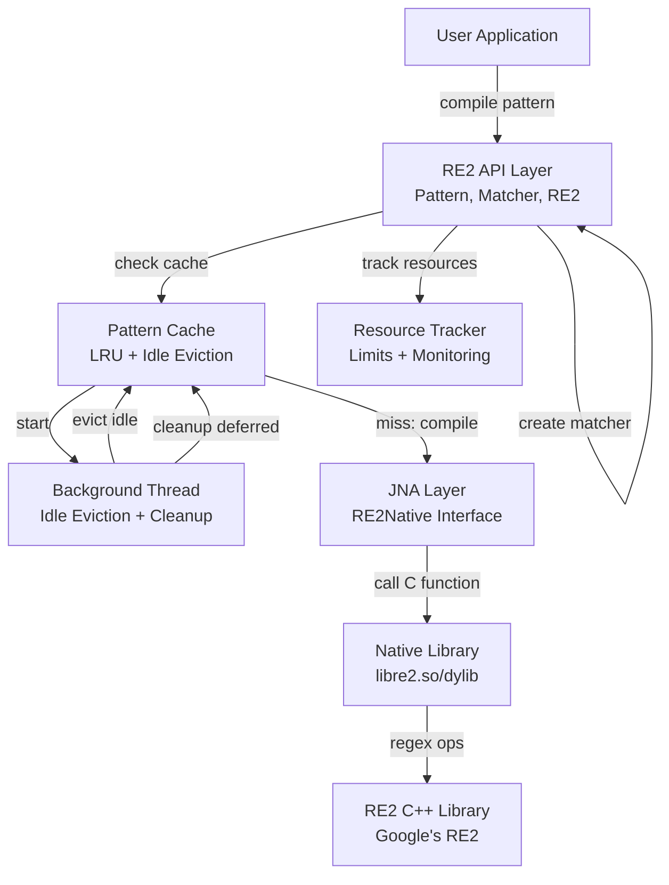
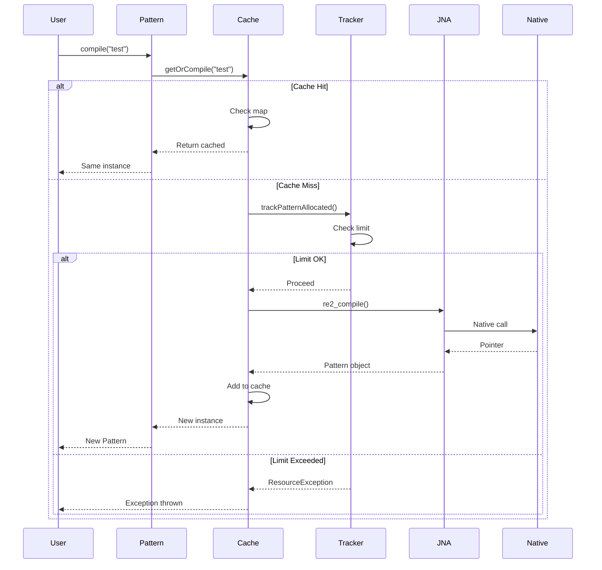
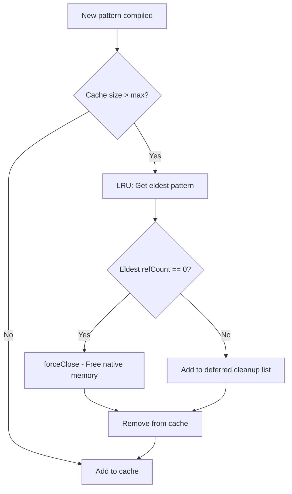
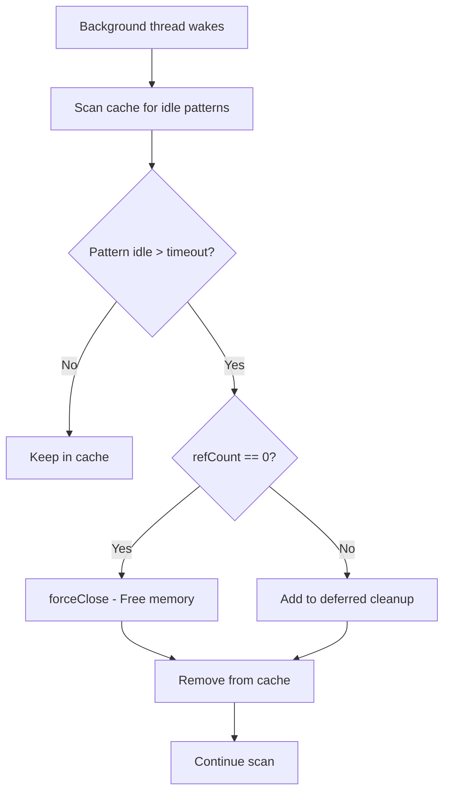
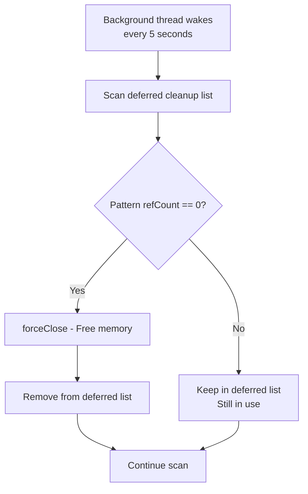
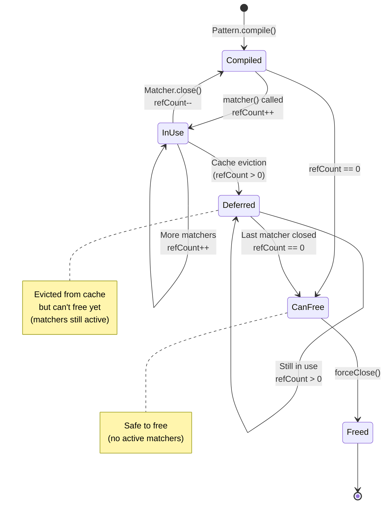
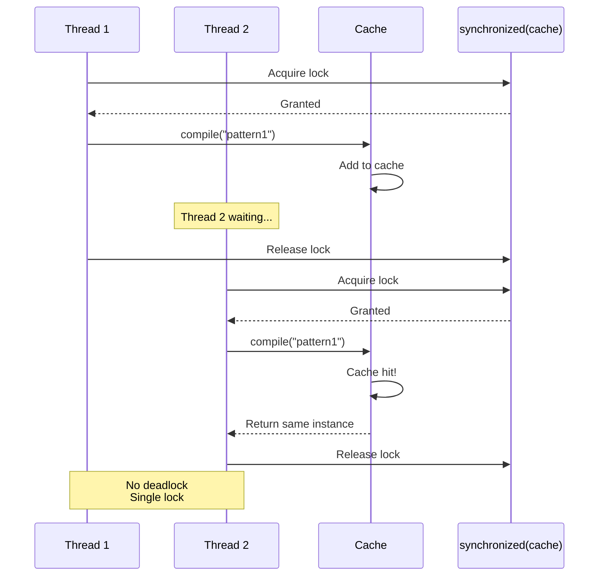
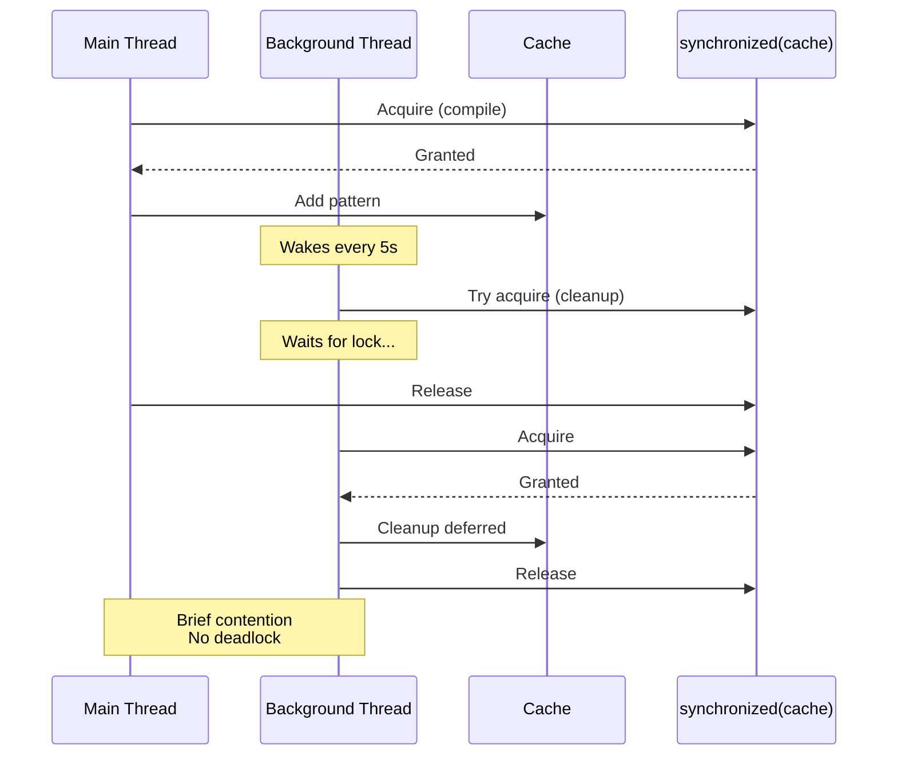
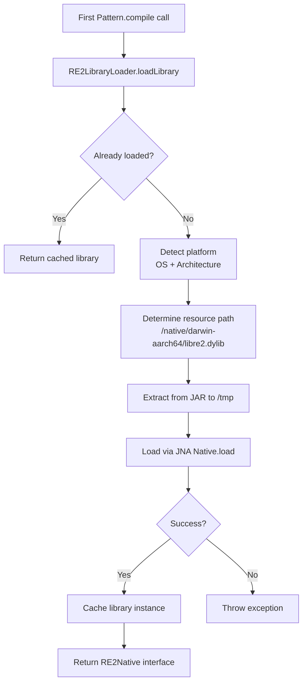

# Architecture

Internal design and implementation details of libre2-java.

---

## System Overview



---

## Pattern Compilation Flow



---

## Cache Eviction Flow

### LRU Eviction (When Cache Full)



### Idle Eviction (Background Thread, Every 60s)



### Deferred Cleanup (Every 5s)



---

## Reference Counting (Use-After-Free Prevention)



---

## Thread Interactions

### Multiple Threads Accessing Cache



### Background Thread Coordination



---

## Memory Layout

### JVM Heap vs Native Memory

```
┌─────────────────────────────────────────────┐
│              JVM Heap Memory                │
│                                             │
│  ┌──────────────────────────────────────┐  │
│  │ Pattern objects                      │  │
│  │ - Java wrapper (small)               │  │
│  │ - Pointer to native                  │  │
│  │ - String fields                      │  │
│  │                                      │  │
│  │ ~1-2 KB each                         │  │
│  └──────────────────────────────────────┘  │
│                                             │
│  ┌──────────────────────────────────────┐  │
│  │ PatternCache                         │  │
│  │ - LinkedHashMap (50K entries)        │  │
│  │ - Statistics (AtomicLongs)           │  │
│  │ - Deferred list                      │  │
│  │                                      │  │
│  │ ~10-20 MB                            │  │
│  └──────────────────────────────────────┘  │
└─────────────────────────────────────────────┘

┌─────────────────────────────────────────────┐
│           Native (Off-Heap) Memory          │
│                                             │
│  ┌──────────────────────────────────────┐  │
│  │ Compiled RE2 Patterns                │  │
│  │ - DFA states                         │  │
│  │ - NFA bytecode                       │  │
│  │ - Metadata                           │  │
│  │                                      │  │
│  │ ~1-50 KB each (varies by complexity)│  │
│  │                                      │  │
│  │ 50K patterns ≈ 50-200 MB            │  │
│  └──────────────────────────────────────┘  │
└─────────────────────────────────────────────┘

Total Memory: ~60-220 MB for 50K cached patterns
```

---

## Critical Design Decisions

### 1. Why Automatic Caching?

**Problem:** Manual caching is error-prone
- Users forget to cache
- Users cache incorrectly (memory leaks)
- Inconsistent performance

**Solution:** Automatic caching in `compile()`
- Always returns cached pattern
- Transparent to user
- Consistent performance

### 2. Why Reference Counting?

**Problem:** Pattern evicted while Matcher using it = crash

**Solution:** Track active Matchers per Pattern
- Matcher.constructor() increments refCount
- Matcher.close() decrements refCount
- forceClose() only frees if refCount == 0

**Result:** Safe under any concurrency

### 3. Why Deferred Cleanup?

**Problem:** Can't free patterns while in use, but they're evicted from cache

**Solution:** Deferred cleanup list
- Evicted patterns with refCount > 0 go to list
- Background thread checks every 5s
- Frees when refCount reaches 0

**Result:** No memory leaks, even under extreme load

### 4. Why Two Eviction Strategies?

**LRU:** Prevents unbounded growth (size limit)
**Idle:** Prevents long-term accumulation (time limit)

**Together:** Adaptive cache that handles both:
- Bursty workloads (LRU keeps size bounded)
- Long-running instances (idle removes forgotten patterns)

---

## Performance Characteristics

### Time Complexity

| Operation | Complexity | Notes |
|-----------|-----------|-------|
| compile() - cache hit | O(1) | HashMap lookup |
| compile() - cache miss | O(n) | n = pattern length, RE2 compilation |
| matcher.find() | O(m) | m = input length, **always linear** |
| matcher.matches() | O(m) | m = input length, **always linear** |
| LRU eviction | O(1) | LinkedHashMap eldest removal |
| Idle eviction | O(k) | k = cache size, full scan |
| Deferred cleanup | O(d) | d = deferred list size |

**No operation is exponential** - critical for production.

### Space Complexity

- **Heap:** O(cache size) for Java objects
- **Native:** O(cache size) for compiled patterns
- **Total:** ~1-4 MB per 1000 patterns

---

## Concurrency Model

**Lock Strategy:** Coarse-grained locking (single lock per cache)

**Why not ConcurrentHashMap?**
- LinkedHashMap provides LRU in access-order mode
- ConcurrentHashMap doesn't support access-order
- Trade-off: Simpler code, proven correct, acceptable performance

**Lock Contention:**
- Typical hold time: < 500 μs (microseconds)
- Under 1000-thread load: Tests show acceptable throughput
- Could optimize later if profiling shows bottleneck

**No Deadlocks:**
- Only one lock in entire codebase (synchronized on cache)
- Never nested
- Verified in stress tests

---

## Error Handling

### Compilation Errors

```java
try {
    Pattern p = RE2.compile("(invalid");
} catch (PatternCompilationException e) {
    // Invalid regex syntax
    String pattern = e.getPattern();  // "(invalid"
    // Log and handle
}
```

### Resource Limit Errors

```java
try {
    Pattern p = RE2.compile("test");
} catch (ResourceException e) {
    // maxSimultaneousCompiledPatterns exceeded
    // Too many active patterns
    // May indicate resource leak in application
}
```

### Native Library Errors

```java
try {
    boolean matches = matcher.find();
} catch (NativeLibraryException e) {
    // Rare: Native RE2 call failed
    // Log and investigate
}
```

---

## Future Enhancements (Not Yet Implemented)

**Phase 3:** Timeout Support
- Per-operation timeout
- ExecutorService-based
- Timeout metrics

**Phase 4:** Metrics Integration
- Dropwizard Metrics adapter
- Cassandra JMX integration
- Full observability

**Phase 5:** Additional Features
- Capture groups support
- Find-all iterations
- Replace operations

---

## Comparison with Other Java RE2 Bindings

| Feature | libre2-java | Other Bindings |
|---------|-------------|----------------|
| Thread-safe | ✅ Yes | ⚠️ Varies |
| Automatic caching | ✅ Yes | ❌ No |
| Resource limits | ✅ Yes | ❌ No |
| Memory leak prevention | ✅ Yes (deferred cleanup) | ⚠️ Manual |
| All platforms | ✅ 4 platforms | ⚠️ Limited |
| Secure build | ✅ Commit pinning + sigs | ⚠️ Varies |
| Production tested | ✅ 163 tests, stress tested | ⚠️ Basic tests |
| High-concurrency optimized | ✅ Yes | ❌ No |

---

## Code Organization

```
libre2-java/
├── src/main/java/com/axonops/libre2/
│   ├── api/              # Public API
│   │   ├── RE2.java           # Main entry point
│   │   ├── Pattern.java       # Compiled pattern (thread-safe)
│   │   ├── Matcher.java       # Matching operations (per-thread)
│   │   └── *Exception.java    # Exception hierarchy (sealed)
│   │
│   ├── cache/            # Caching layer
│   │   ├── PatternCache.java      # LRU cache implementation
│   │   ├── IdleEvictionTask.java  # Background thread
│   │   ├── RE2Config.java         # Configuration (record)
│   │   └── CacheStatistics.java   # Metrics (record)
│   │
│   ├── jni/              # JNA integration
│   │   ├── RE2Native.java         # JNA interface (8 functions)
│   │   └── RE2LibraryLoader.java  # Platform detection, loading
│   │
│   └── util/             # Utilities
│       └── ResourceTracker.java   # Resource counting, limits
│
├── src/main/resources/native/     # Pre-compiled libraries
│   ├── darwin-x86_64/libre2.dylib
│   ├── darwin-aarch64/libre2.dylib
│   ├── linux-x86_64/libre2.so
│   └── linux-aarch64/libre2.so
│
├── native/               # Native build system
│   ├── wrapper/re2_wrapper.cpp    # C wrapper (8 functions)
│   ├── scripts/build.sh           # Build script
│   └── Dockerfile                 # Linux builds
│
└── src/test/java/        # 163 comprehensive tests
```

---

## Key Implementation Details

### Pattern Cache (LinkedHashMap)

**Why LinkedHashMap?**
- Access-order mode provides LRU automatically
- `removeEldestEntry()` callback for eviction
- Simpler than manual LRU tracking

**Thread Safety:**
- All operations `synchronized(cache)`
- Single lock, no nesting
- Brief hold times (< 500 μs)

### Reference Counting

**Implementation:**
```java
class Pattern {
    private final AtomicInteger refCount = new AtomicInteger(0);

    void incrementRefCount() {  // Called by Matcher constructor
        int current = refCount.incrementAndGet();
        if (current > maxMatchersPerPattern) {
            refCount.decrementAndGet();  // Rollback
            throw ResourceException;
        }
    }

    void decrementRefCount() {  // Called by Matcher.close()
        refCount.decrementAndGet();
    }

    public void forceClose() {
        if (refCount.get() > 0) {
            return;  // Can't free - still in use
        }
        freeNativeResources();
    }
}
```

### Deferred Cleanup List

**Implementation:**
```java
private final CopyOnWriteArrayList<CachedPattern> deferredCleanup;

// Add when evicting in-use pattern:
if (pattern.getRefCount() > 0) {
    deferredCleanup.add(pattern);
}

// Cleanup (every 5s):
for (CachedPattern deferred : deferredCleanup) {
    if (deferred.pattern().getRefCount() == 0) {
        deferred.forceClose();
        deferredCleanup.remove(deferred);
    }
}
```

**Why CopyOnWriteArrayList?**
- Thread-safe iteration without lock
- Modifications don't affect ongoing iterations
- Fast reads (no locks)

---

## Native Integration

### JNA Call Path

```
Java:  matcher.find()
  ↓
JNA:   RE2Native.re2_partial_match(pointer, text, length)
  ↓
C:     int re2_partial_match(void* pattern, char* text, int len)
  ↓
C++:   RE2::PartialMatch(text, *pattern)
  ↓
RE2:   DFA/NFA execution (linear time)
  ↓
Return: 1 (match), 0 (no match), -1 (error)
```

### Library Loading



### Platform Detection

```java
OS: System.getProperty("os.name")
  - "Mac OS X" → MACOS
  - "Linux" → LINUX

Architecture: System.getProperty("os.arch")
  - "amd64", "x86_64" → X86_64
  - "aarch64", "arm64" → AARCH64

Resource path:
  MACOS + X86_64 → /native/darwin-x86_64/libre2.dylib
  MACOS + AARCH64 → /native/darwin-aarch64/libre2.dylib
  LINUX + X86_64 → /native/linux-x86_64/libre2.so
  LINUX + AARCH64 → /native/linux-aarch64/libre2.so
```

---

## Testing Strategy

### Test Categories

1. **Core API (89 tests):** Pattern/Matcher functionality
2. **Configuration (14 tests):** Validation, builder, defaults
3. **Caching (12 tests):** Hits, misses, LRU, statistics
4. **Concurrency (7 tests):** 100+ thread compilation/matching
5. **Eviction Safety (6 tests):** Use-after-free prevention
6. **Edge Cases (6 tests):** Boundary conditions
7. **Resource Limits (5 tests):** Limit enforcement
8. **Thread Safety (5 tests):** Deadlocks, race conditions
9. **Idle Eviction (5 tests):** Background eviction
10. **Stress (4 tests):** Sustained load, 60K+ patterns
11. **Cleanup (4 tests):** Concurrent close operations
12. **Cache Full (3 tests):** Critical memory leak scenario
13. **Timing (3 tests):** Deferred cleanup frequency

**Total:** 163 tests covering all critical paths

---

## Dependencies

### Compile-Time

- **JNA 5.13.0:** Java Native Access (provided scope)
- **SLF4J 2.0.9:** Logging (provided scope)

### Native Libraries (Embedded)

- **RE2 (2025-11-05):** Regex engine
- **Abseil (20250814.1):** C++ utilities (statically linked)

### Build-Time Only

- **JUnit 5:** Testing
- **AssertJ:** Assertions
- **Logback:** Test logging

**Production JAR:** 2.4 MB (just our code + native libraries)

---

## Security Considerations

### Native Library Provenance

1. **Source:** Git commits from google/re2 and abseil/abseil-cpp
2. **Commits:** Pinned in GitHub environment variables (admin-only)
3. **Verification:** Signature checked via GitHub API
4. **Build:** Automated GitHub Actions (reproducible)
5. **Result:** Cryptographically verifiable binaries

### Supply Chain Security

- **No tarball downloads:** Git clone from known commits
- **No package managers:** Build from source
- **No external binaries:** Compile everything
- **Signed commits:** Google engineer signatures verified
- **Audit trail:** All builds logged in GitHub Actions

---

## Limitations

### Current

1. **Single global cache:** One configuration for entire JVM
   - Workaround: Adjust before first use
   - Fix: Phase 3 will add per-instance config

2. **Windows not supported:** Intentionally omitted (complexity)
   - Focus: Production Linux/macOS deployments

3. **No capture groups yet:** Only match/find operations
   - Coming: Phase 5

### By Design

1. **Matcher not thread-safe:** Intentional (matches Java Pattern/Matcher design)
2. **Soft resource limits:** Can exceed by concurrent thread count (acceptable)
3. **Coarse-grained locking:** Single cache lock (acceptable performance)

**None of these affect production deployment.**
